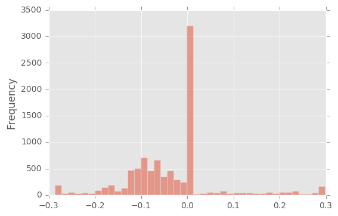
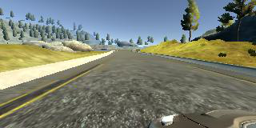

# Behavioral Cloning: Navigating a Car in a Simulator

Overview
---

In this project for the Udacity Self-Driving Car Nanodegree a deep CNN  is developed that can steer a car in a simulator provided by Udacity. The CNN drives the car autonomously around a track. The network is trained on images from a video stream that was recorded while a human was steering the car. The CNN thus clones the human driving behavior.

The steps of this project are the following:

* Use the simulator to collect data of good driving behavior
* Build, a convolution neural network in Keras that predicts steering angles from images
* Train and validate the model with a training and validation set
* Test that the model successfully drives around track one without leaving the road
* Summarize the results with a written report

Data was collected by me while driving around the track 1 in simulator. I used a ps4 controller to drive around the track. I then used image augmentation to generate multiple training samples that represented driving under different driving conditions.

You can find most of the image effect (image augmentation in `dataset.py` file). The trained model was tested on two tracks, namely training track and validation track. Following two animations show the performance of our final model in both training and validation tracks.

Training | Validation
------------|---------------
 | 


### Dependencies

This project requires **Python 3.5** and the following Python libraries installed:

- [Keras](https://keras.io/)
- [Pandas](http://pandas.pydata.org/)
- [OpenCV](http://opencv.org/)
- [Matplotlib](http://matplotlib.org/) (Optional)
- [Jupyter](http://jupyter.org/) (Optional)
- [NumPy](http://www.numpy.org/)
- [SciPy](https://www.scipy.org/)
- [TensorFlow](http://tensorflow.org)

## Getting started

The project includes the following files:

* `behavioral_cloning_net.py` containing the script to create, train, test, validate and save the model.
* `drive.py` for driving the car in autonomous mode
* `dataset.py` for image augmentation (resize, crop, shering .. etc)
* `model.h5` containing a trained convolution neural network 
* this README.md, [this article](https://medium.com/@ksakmann/behavioral-cloning-make-a-car-drive-like-yourself-dc6021152713) and image_transformation_pipeline.ipynb for explanation.

Additionally you need to download and unpack the [Udacity self-driving car simulator](https://github.com/udacity/self-driving-car-sim) (Version 1 was used). To run the code start the simulator in `autonomous mode`, open another shell and type 

```
python drive.py model.h5
```

To train the model, first make a directory `../data/data`, drive the car in `training mode` around the track and save the data to this directory. The model is then trained by typing 
```
BehNet = BehavioralCloningNet()
BehNet.build_model()
BehNet.compile()
BehNet.train()
BehNet.save()
```
The rest of this `README.md` provides details about the model used.

You can find all the steps I used to train and save the model in `playground` notebook included in this repo.

## General considerations

The simulated car is equipped with three cameras, one to the left, one in the center and one to the right of the driver that provide images from these different view points. The training track has sharp corners, exits, entries, bridges, partially missing lane lines and changing light conditions. An additional test track exists with changing elevations, even sharper turns and bumps. It is thus crucial that the CNN does not merely memorize the first track, but generalizes to unseen data in order to perform well on the test track. The model developed here was trained exclusively on the training track and completes the test track.

The main problem lies in the skew and bias of the data set. Shown below is a histogram of the steering angles recorded while driving in the middle of the road for a few laps. This is also the data used for training. The left-right skew is less problematic and can be eliminated by flipping images and steering angles simultaneously. However, even after balancing left and right angles most of the time the steering angle during normal driving is small or zero and thus introduces a bias towards driving straight. The most important events however are those when the car needs to turn sharply. 

<p align="center">
 
</p>

Without accounting for this bias towards zero, the car leaves the track quickly. One way to counteract this problem is to  purposely let the car drift  towards the side of the road and to start recovery in the very last moment. 

However, the correct large steering angles are not easy to generate this way, because even then most of the time the car drives straight, with the exception of the short moment when the driver avoids a crash or the car going off the road. 

### Data Capturing

During the training, the simulator captures data with a frequency of 10hz. Also, at a given time step it recorded three images taken from left, center, and right cameras. The following figure shows an example I have collected during the training time.

Left| Center | Right
----|--------|-------
 |  | 

The dataset consists of 24108 images (8036 images per camera angle). The training track contains a lot of shallow turns and straight road segments. Hence, the majority of the recorded steering angles are zeros. Therefore, preprocessing images and respective steering angles are necessary in order to generalize the training model for unseen tracks such as our validation track.

### Data Preprocessing

- We apply random shear operation. However, we select images with 0.9 probability for the random shearing process. 

- To help the system avoid learning other part of the image but only the track, user crops out the sky and car deck parts in the image. Original image size (160x320), after cropping 60px on top and 20px on the bottom, new image size is (80x320).

- The next stage of the data processing pipeline is called random flip stage. In this stage we randomly (with 0.5 probability) flip images. The idea behind this operation is left turning bends are more prevalent than right bends in the training track.

- To help running a smaller training model, images are scaled to (64x64) size from cropped size (80x320).

### Network Architecture 

Our convolutional neural network architecture was inspired by NVIDIA's End to End Learning for Self-Driving Cars paper. The main difference between our model and the NVIDIA mode is than we did use MaxPooling layers just after each  Convolutional Layer in order to cut down training time. 

- 1st layer: normalize input image to -0.5 to 0.5 range.

- For optimizer, Adam optimizer is used. I started with 0.001 training rate but 0.0001 seems to produce a smoother ride. Therefore, I kept 0.0001 learning rate.

```
____________________________________________________________________________________________________
Layer (type)                     Output Shape          Param #     Connected to                     
====================================================================================================
lambda_1 (Lambda)                (None, 64, 64, 3)     0           lambda_input_1[0][0]             
____________________________________________________________________________________________________
convolution2d_1 (Convolution2D)  (None, 32, 32, 24)    1824        lambda_1[0][0]                   
____________________________________________________________________________________________________
activation_1 (Activation)        (None, 32, 32, 24)    0           convolution2d_1[0][0]            
____________________________________________________________________________________________________
maxpooling2d_1 (MaxPooling2D)    (None, 31, 31, 24)    0           activation_1[0][0]               
____________________________________________________________________________________________________
convolution2d_2 (Convolution2D)  (None, 16, 16, 36)    21636       maxpooling2d_1[0][0]             
____________________________________________________________________________________________________
activation_2 (Activation)        (None, 16, 16, 36)    0           convolution2d_2[0][0]            
____________________________________________________________________________________________________
maxpooling2d_2 (MaxPooling2D)    (None, 15, 15, 36)    0           activation_2[0][0]               
____________________________________________________________________________________________________
convolution2d_3 (Convolution2D)  (None, 8, 8, 48)      43248       maxpooling2d_2[0][0]             
____________________________________________________________________________________________________
activation_3 (Activation)        (None, 8, 8, 48)      0           convolution2d_3[0][0]            
____________________________________________________________________________________________________
maxpooling2d_3 (MaxPooling2D)    (None, 7, 7, 48)      0           activation_3[0][0]               
____________________________________________________________________________________________________
convolution2d_4 (Convolution2D)  (None, 7, 7, 64)      27712       maxpooling2d_3[0][0]             
____________________________________________________________________________________________________
activation_4 (Activation)        (None, 7, 7, 64)      0           convolution2d_4[0][0]            
____________________________________________________________________________________________________
maxpooling2d_4 (MaxPooling2D)    (None, 6, 6, 64)      0           activation_4[0][0]               
____________________________________________________________________________________________________
convolution2d_5 (Convolution2D)  (None, 6, 6, 64)      36928       maxpooling2d_4[0][0]             
____________________________________________________________________________________________________
activation_5 (Activation)        (None, 6, 6, 64)      0           convolution2d_5[0][0]            
____________________________________________________________________________________________________
maxpooling2d_5 (MaxPooling2D)    (None, 5, 5, 64)      0           activation_5[0][0]               
____________________________________________________________________________________________________
flatten_1 (Flatten)              (None, 1600)          0           maxpooling2d_5[0][0]             
____________________________________________________________________________________________________
dense_1 (Dense)                  (None, 1164)          1863564     flatten_1[0][0]                  
____________________________________________________________________________________________________
activation_6 (Activation)        (None, 1164)          0           dense_1[0][0]                    
____________________________________________________________________________________________________
dense_2 (Dense)                  (None, 100)           116500      activation_6[0][0]               
____________________________________________________________________________________________________
activation_7 (Activation)        (None, 100)           0           dense_2[0][0]                    
____________________________________________________________________________________________________
dense_3 (Dense)                  (None, 50)            5050        activation_7[0][0]               
____________________________________________________________________________________________________
activation_8 (Activation)        (None, 50)            0           dense_3[0][0]                    
____________________________________________________________________________________________________
dense_4 (Dense)                  (None, 10)            510         activation_8[0][0]               
____________________________________________________________________________________________________
activation_9 (Activation)        (None, 10)            0           dense_4[0][0]                    
____________________________________________________________________________________________________
dense_5 (Dense)                  (None, 1)             11          activation_9[0][0]               
====================================================================================================
Total params: 2,116,983
Trainable params: 2,116,983
Non-trainable params: 0
```

### Training

Even after cropping and resizing training images (with all augmented images), training dataset was very large and it could not fit into the main memory. Hence, we used `fit_generator` API of the Keras library for training our model.

We created two generators namely:

* `train_batch = Dataset().next_batch()`
* `validation_batch = Dataset().next_batch()` 

Batch size of both `train_batch` and `validation_batch` was 64. We used 20032 images per training epoch. It is to be noted that these images are generated on the fly using the document processing pipeline described above. In addition to that, we used 6400 images (also generated on the fly) for validation. We used `Adam` optimizer with `1e-4` learning rate. Finally, when it comes to the number of training epochs we tried several possibilities such as `5`, `8`, `1`0, `2`5 and `50`. However, `6` works well on both training and validation tracks. 


## Results and conclusion

By making consequent use of image augmentation with according steering angle updates we could train a neural network to recover the car from extreme events, like suddenly appearing curves change of lighting conditions by exclusively simulating such events from regular driving data. 

