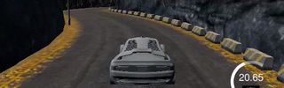

# Behavioral Cloning: Navigating a Car in a Simulator

Overview
---

In this project for the Udacity Self-Driving Car Nanodegree a deep CNN  is developed that can steer a car in a simulator provided by Udacity. The CNN drives the car autonomously around a track. The network is trained on images from a video stream that was recorded while a human was steering the car. The CNN thus clones the human driving behavior.

The steps of this project are the following:

* Use the simulator to collect data of good driving behavior
* Build, a convolution neural network in Keras that predicts steering angles from images
* Train and validate the model with a training and validation set
* Test that the model successfully drives around track one without leaving the road
* Summarize the results with a written report

Data was collected by me while driving around the track 1 in simulator. I used a ps4 controller to drive around the track. I then used image augmentation to generate multiple training samples that represented driving under different driving conditions.

You can find most of the image effect (image augmentation in `dataset.py` file). The trained model was tested on two tracks, namely training track and validation track. Following two animations show the performance of our final model in both training and validation tracks.

Training | Validation
------------|---------------
 | 


Creating a Great Writeup
---
A great writeup should include the [rubric points](https://review.udacity.com/#!/rubrics/432/view) as well as your description of how you addressed each point.  You should include a detailed description of the code used (with line-number references and code snippets where necessary), and links to other supporting documents or external references.  You should include images in your writeup to demonstrate how your code works with examples.  

All that said, please be concise!  We're not looking for you to write a book here, just a brief description of how you passed each rubric point, and references to the relevant code :). 

You're not required to use markdown for your writeup.  If you use another method please just submit a pdf of your writeup.

The Project
---
The goals / steps of this project are the following:
* Use the simulator to collect data of good driving behavior 
* Design, train and validate a model that predicts a steering angle from image data
* Use the model to drive the vehicle autonomously around the first track in the simulator. The vehicle should remain on the road for an entire loop around the track.
* Summarize the results with a written report

### Dependencies
This lab requires:

* [CarND Term1 Starter Kit](https://github.com/udacity/CarND-Term1-Starter-Kit)

The lab enviroment can be created with CarND Term1 Starter Kit. Click [here](https://github.com/udacity/CarND-Term1-Starter-Kit/blob/master/README.md) for the details.

The following resources can be found in this github repository:
* drive.py
* video.py
* writeup_template.md

The simulator can be downloaded from the classroom. In the classroom, we have also provided sample data that you can optionally use to help train your model.

## Details About Files In This Directory

### `drive.py`

Usage of `drive.py` requires you have saved the trained model as an h5 file, i.e. `model.h5`. See the [Keras documentation](https://keras.io/getting-started/faq/#how-can-i-save-a-keras-model) for how to create this file using the following command:
```sh
model.save(filepath)
```

Once the model has been saved, it can be used with drive.py using this command:

```sh
python drive.py model.h5
```

The above command will load the trained model and use the model to make predictions on individual images in real-time and send the predicted angle back to the server via a websocket connection.

#### Saving a video of the autonomous agent

```sh
python drive.py model.h5 run1
```

The fourth argument `run1` is the directory to save the images seen by the agent to. If the directory already exists it'll be overwritten.

```sh
ls run1

[2017-01-09 16:10:23 EST]  12KiB 2017_01_09_21_10_23_424.jpg
[2017-01-09 16:10:23 EST]  12KiB 2017_01_09_21_10_23_451.jpg
[2017-01-09 16:10:23 EST]  12KiB 2017_01_09_21_10_23_477.jpg
[2017-01-09 16:10:23 EST]  12KiB 2017_01_09_21_10_23_528.jpg
[2017-01-09 16:10:23 EST]  12KiB 2017_01_09_21_10_23_573.jpg
[2017-01-09 16:10:23 EST]  12KiB 2017_01_09_21_10_23_618.jpg
[2017-01-09 16:10:23 EST]  12KiB 2017_01_09_21_10_23_697.jpg
[2017-01-09 16:10:23 EST]  12KiB 2017_01_09_21_10_23_723.jpg
[2017-01-09 16:10:23 EST]  12KiB 2017_01_09_21_10_23_749.jpg
[2017-01-09 16:10:23 EST]  12KiB 2017_01_09_21_10_23_817.jpg
...
```

The image file name is a timestamp when the image image was seen. This information is used by `video.py` to create a chronological video of the agent driving.

### `video.py`

```sh
python video.py run1
```

Create a video based on images found in the `run1` directory. The name of the video will be name of the directory following by `'.mp4'`, so, in this case the video will be `run1.mp4`.

Optionally one can specify the FPS (frames per second) of the video:

```sh
python video.py run1 --fps 48
```

The video will run at 48 FPS. The default FPS is 60.

#### Why create a video

1. It's been noted the simulator might perform differently based on the hardware. So if your model drives succesfully on your machine it might not on another machine (your reviewer). Saving a video is a solid backup in case this happens.
2. You could slightly alter the code in `drive.py` and/or `video.py` to create a video of what your model sees after the image is processed (may be helpful for debugging).
